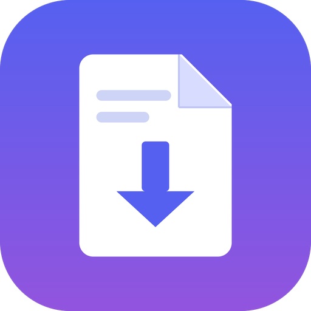

<div align="center">



# Document to Markdown

**Drop a file or a folder in. Get Markdown out.**
No terminal, no configuration. Mac, Windows and Linux.

[](https://github.com/charles-martech/markdown-anything/actions/workflows/ci.yml)
[](LICENSE)

</div>

Turn a document, or a folder full of them, into Markdown. Word, PDF,
PowerPoint, Excel, web pages, ebooks, wiki exports, LaTeX, man pages and about
sixty other formats. Choose one file and get one `.md` file; choose a folder
and every file inside becomes one, with the folder structure kept and a report
of anything it could not read.

It runs entirely on your computer. Nothing is uploaded anywhere. It is also
the cheapest way for an AI assistant to read a document: see
[Reading documents with AI](#reading-documents-with-ai-assistants) below.

## Install on a Mac

Paste this into Terminal once, press return:

```bash
curl -fsSL https://raw.githubusercontent.com/charles-martech/markdown-anything/main/install.sh | bash
```

That installs the newest release, puts **Document to Markdown** in your
Applications and on your Desktop, and opens it. From then on it is a normal
app: double-click the icon.

The first time you open it, it offers to set itself up. Click the button and it
downloads what it needs into its own folder. No administrator password, no
Homebrew, nothing added to the rest of your Mac. Deleting the app and its folder
in `~/Library/Application Support/Document to Markdown` removes every trace.

The install line above runs a script from this repository on your computer,
which is a thing worth being careful about in general. To read it before you
run it, [SECURITY.md](SECURITY.md#the-install-line) has the three commands that
download it, show it to you, and then run it.

## Install on Windows

Python 3.9 or newer needs to be there first: from
[python.org](https://www.python.org/downloads/windows/) (tick **Add python.exe
to PATH**) or from the Microsoft Store. Then open PowerShell and paste:

```powershell
irm https://raw.githubusercontent.com/charles-martech/markdown-anything/main/windows/install.ps1 | iex
```

That installs the newest release into `%LOCALAPPDATA%\Document to Markdown`,
puts a **Document to Markdown** shortcut on your Desktop and in the Start Menu,
and opens it. No administrator rights, nothing installed system-wide. Deleting
that folder and the two shortcuts removes every trace.

## Install on Linux

Paste this into a terminal once:

```bash
curl -fsSL https://raw.githubusercontent.com/charles-martech/markdown-anything/main/install.sh | bash
```

That installs the newest release into `~/.local/share/document-to-markdown`,
adds **Document to Markdown** to your applications menu and your Desktop, and
opens it. It needs Python 3, which nearly every distribution ships. The file
and folder dialogs use `zenity` or `kdialog`, whichever your desktop has; with
neither, the page still takes a typed path.

## Keeping it up to date

The app can update itself. When a newer release exists it shows you what
changed and offers to install it; quit, open it again, and you are on the new
version.

**You decide when it looks.** The first time you open it, it asks — plainly,
once — which you would rather have:

- **Check automatically.** Once a day it asks GitHub whether a newer version
  exists. Fixes, including security ones, reach you without you thinking about
  it. The cost is one request a day that tells GitHub your computer's address.
- **Only when I ask.** A **Check for updates** button at the bottom of the page,
  and otherwise total silence. Nothing is ever sent unless you press it. The
  cost is that a fix waits until you go looking for it.

Neither is preselected, and you can change your mind at any time with the
checkbox next to that button. Your documents are not involved either way.

If an update ever fails, nothing changes: the copy you have keeps working,
because a downloaded version has to start successfully on your Mac before it is
allowed to replace one that already does.

## Using it

1. **Choose files, or a folder.** One document, a few at once, or a whole
   folder including its subfolders. It counts what you picked so you can see
   it is right.
2. **Check where it goes.** A new folder next to the original, filled in for
   you. Your files are never changed or moved. A single file goes where a
   conversion of its whole folder would put it, so converting one file today
   and the folder next month lands everything in one place with nothing done
   twice.
3. **Convert.** Watch the progress, then click through to the result: the
   folder, or, when you converted one file, that file.

Options are all optional and written in plain language. Each one says whether it
starts on or off and why, so there is nothing to guess at. Only one, saving
pictures and diagrams, is on to begin with.

## What it converts

| Family | Formats |
| --- | --- |
| Word processors | `.docx` `.doc` `.odt` `.rtf` `.pages` `.wpd` and more |
| PDF | `.pdf`, including scans when OCR is available |
| Slides | `.pptx` `.ppt` `.odp` `.key` |
| Spreadsheets | `.xlsx` `.xls` `.ods` `.csv` `.tsv` |
| Web and ebooks | `.html` `.epub` `.fb2` |
| Wikis | MediaWiki, DokuWiki, TikiWiki, TWiki, VimWiki, Jira, Creole, Muse |
| Documentation | reStructuredText, AsciiDoc, DocBook, JATS, Texinfo, Org, POD |
| Typesetting | LaTeX, Typst, man and roff pages |
| Data and outlines | JSON, YAML, TOML, XML, OPML, notebooks |
| Bibliographies | BibTeX, BibLaTeX, RIS, CSL JSON, EndNote |
| Terminal output | `.log` `.ansi` and other captures, colour codes stripped |

[`docs/formats.md`](docs/formats.md) has the complete list, which engine reads
each format, and what to expect from the result.

Slides keep their titles, bullet levels, tables and speaker notes. Spreadsheets
become one table per sheet, under the sheet's own name. Embedded images are
saved next to each Markdown file with the links already pointing at them.

A diagram in a PDF is drawn, not written, so its labels arrive as scrambled
fragments no reader can follow. Pages that hold a flowchart, an org chart or an
architecture drawing are saved as pictures alongside those images and linked
from the Markdown where the scrambled text would have been.

## Things it does that matter on a real folder

- **One bad file never stops the run.** It is recorded in the report and the
  rest keeps converting.
- **Running it again is cheap.** Files whose source has not changed are left
  alone, so a second pass over a big folder takes seconds.
- **Your originals are never touched.** Output goes to a separate folder, and it
  refuses to write inside the folder it is reading.
- **Two files with the same name stay separate.** `report.docx` and `report.pdf`
  become `report-docx.md` and `report-pdf.md`, never one silently overwriting
  the other.
- **Failures are explained in plain words**, not engine error codes.

## Reading documents with AI assistants

An assistant that opens a PDF directly pays for every page as an image or as
raw XML: many times the tokens of the words in it, a context window filled in
a few pages, and the headings and tables lost. Converting to Markdown first,
on your machine, fixes all three. This repository makes that the default in
three ways, and all three find the engines the app installed, so setting the
app up once is enough:

- **Claude Code**: the skill in `.claude/skills/doc-to-gfm/` tells it to
  convert a document before reading it. Copy that folder to
  `~/.claude/skills/` to have it in every project.
- **Claude Desktop, Cursor, Gemini CLI, Codex CLI, ChatGPT, and anything else
  that speaks MCP**: `scripts/mcp_server.py` is a dependency-free MCP server
  with a `convert_document` tool that returns the Markdown, in pieces for
  long documents, and a `convert_folder` tool for a whole folder.
- **Any assistant that can run a command**:
  `python3 scripts/doc2gfm.py FILE --stdout` prints the Markdown and writes
  nothing.

[`docs/ai-agents.md`](docs/ai-agents.md) has the two-line configuration for
each tool and a paragraph to paste into an `AGENTS.md`.

## Without the app

The converter is a single Python file with no dependencies of its own:

```bash
python3 scripts/doc2gfm.py ~/Documents/exports -o ~/Documents/markdown
python3 scripts/doc2gfm.py ~/Documents/report.pdf --stdout
```

Useful flags: `--stdout`, `--flat`, `--include pdf`, `--force`, `--no-media`,
`--ocr`, `--dry-run`. Run `scripts/setup.sh` to check which engines are
installed, `scripts/selftest.sh` to convert a fixture of every major format and
prove the install works, and `python3 -m unittest discover -s tests` for the
fast tests, which need nothing installed at all.

It runs the same on macOS, Windows and Linux. PDFs, slides, spreadsheets and
text formats need no engine at all; Word, HTML, EPUB and most of the rest need
Pandoc, which the app installs for itself and `scripts/setup.sh` installs for
a terminal.

## What it uses

[Pandoc](https://pandoc.org) does most of the reading. LibreOffice, if you have
it, handles older Office formats and Apple's Pages and Keynote. PDFs are read by
[PyMuPDF](https://pymupdf.readthedocs.io) with `pdftotext` as a fallback.
PowerPoint and Excel files are read directly, so those two need nothing extra.

The app installs Pandoc and the Python readers for you, into its own folder.
LibreOffice is a large signed installer, so it points you at the official
download instead of fetching it silently.

## Your files stay yours

Your documents are read on your computer, converted on your computer, and
written on your computer. No file, and nothing out of a file — not a name, not
a word of the contents — is ever sent anywhere. There is no account, no server
of ours, and no telemetry. The converter itself never opens a network
connection at all.

The app reaches the network in two situations, and nothing else:

- **Setting up**, when you click the button: it fetches Pandoc from its official
  GitHub release and the PDF and spreadsheet readers from PyPI, into the app's
  own folder and nowhere else on your Mac.
- **Looking for a newer version**: either once a day or only when you press the
  button, whichever you chose the first time you opened it.

Both send your computer's address, because every request on the internet does,
and nothing else besides.

The interface is a page served by a small server on your own machine. It is
bound to `127.0.0.1` so nothing on your network can reach it, every request
carries a token created when it starts, and requests naming any other host are
refused — which is what stops a website you happen to have open from reaching
in. The MCP server talks to an AI tool through a pipe on this computer and
opens no network connection of its own. [SECURITY.md](SECURITY.md) explains
this properly, and is where to report anything that looks wrong with it.

## If something goes wrong

**The icon does nothing.** The app keeps running in the background after you
close its tab, and clicking the icon reopens that same page. If nothing opens
at all, the server has stopped: open the app again, and if it still does
nothing, look at `log.txt` in the app's folder: on a Mac
`~/Library/Application Support/Document to Markdown`, on Windows
`%LOCALAPPDATA%\Document to Markdown`, on Linux
`~/.local/share/document-to-markdown`. (Before version 1.0.3 this could also
be the app waiting on a name server it could not reach. It no longer asks one
anything.)

**It says a tool is missing that you know you installed.** An app opened from
an icon does not see the same `PATH` as your terminal, so the app looks in the
usual places itself: Homebrew, MacPorts, `/usr/local/bin`, `Program Files`,
and inside the LibreOffice application folder on each system. Anything
installed somewhere unusual can be pointed at by launching the app from a
terminal instead, which inherits your shell environment: on a Mac
`python3 "/Applications/Document to Markdown.app/Contents/Resources/app/server.py"`,
elsewhere `python3` (or `python`) followed by the path of `app/server.py`
inside the app's folder.

**Stopping it completely.** Use the "Quit the app" button at the bottom of the
page. It also stops itself after thirty minutes with nothing to do and no page
looking at it; a page left open in front of you keeps it alive.

**The page says it has lost the app.** The app stopped in the background,
either after those idle minutes with the tab hidden or because it was
reinstalled. Open it again from your Desktop, which starts it fresh in a new
tab, and close the old one. Nothing about your files is affected.

**On Windows, the file dialog opened behind the browser.** It is a plain
Windows dialog and some browsers keep themselves on top; look in the taskbar.
Typing the path into the page works too.

**An update went wrong.** Delete the `current` folder inside the app's folder
(the paths above) and open the app again. That puts back the version that came
with the app. Nothing else is affected, and your converted files are somewhere
else entirely.

**Removing it.** On a Mac, delete the app from Applications, the Desktop
shortcut, and `~/Library/Application Support/Document to Markdown`. On Windows,
delete `%LOCALAPPDATA%\Document to Markdown` and the two shortcuts. On Linux,
delete `~/.local/share/document-to-markdown`,
`~/.local/share/applications/document-to-markdown.desktop` and the copy on
your Desktop. Nothing else was touched.

## If it helped

A star on GitHub is what makes a project like this findable by the next person
searching for a way to read their PDFs as text, and it costs a click. Sharing
the install line with someone who converts documents by hand does the rest.

## Contributing

Bug reports about a format that converted badly are the most useful thing, and
attaching the file that failed is what makes them fixable. The converter's
routing table is one dictionary at the top of `scripts/doc2gfm.py`; adding a
format is usually one line.

[CONTRIBUTING.md](CONTRIBUTING.md) has how to run it from a checkout and what
to run before opening a pull request. Security problems go
[privately](SECURITY.md), please, not into an issue.

MIT licensed.
